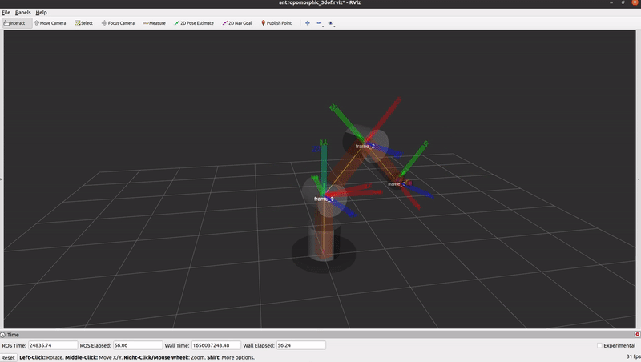

# CheckPoint 7 Manipulation Perception

<a name="readme-top"></a>

## About The Project
The purpose of this project is to find the Denavit-Hartenberg parameters of the robotic arm, then calculate the forward and inverse kinematics. Finally, using the inverse kinematics move the arm in an elipsoidal motion.



<!-- GETTING STARTED -->
## Getting Started

### Software Prerequisites
* Ubuntu 22.04
* ROS Noetic


<p align="right">(<a href="#readme-top">back to top</a>)</p>

<!-- INSTALLATION -->
### Installation
1. Clone the repo:
   ```sh
   cd ~ && \
   git clone https://github.com/pvela2017/The-Construct-CheckPoint-12-Arm-Kinematics
   ```
2. Compile the simulation:
   ```sh
   source /opt/ros/noetic/setup.bash && \
   cd ~/The-Construct-CheckPoint-12-Arm-Kinematics/simulation_ws && \
   catkin_make && \
   cd ~/The-Construct-CheckPoint-12-Arm-Kinematics/catkin_ws && \
   catkin_make
   ```
     
<p align="right">(<a href="#readme-top">back to top</a>)</p>


<!-- USAGE -->
## Usage
### Local Simulation
1. Launch the simulation:
   ```sh
   source /opt/ros/noetic/setup.bash && \
   source ~/The-Construct-CheckPoint-12-Arm-Kinematics/simulation_ws/devel/setup.bash && \
   roslaunch antropomorphic_arm_gazebo main.launch
   ```
2. DH matrix:
   ```sh
   source /opt/ros/noetic/setup.bash && \
   source ~/The-Construct-CheckPoint-12-Arm-Kinematics/catkin_ws/devel/setup.bash && \
   rosrun antropomorphic_project generate_matrixes.py
   ```
3. Forward kinematics:
   ```sh
   source /opt/ros/noetic/setup.bash && \
   source ~/The-Construct-CheckPoint-12-Arm-Kinematics/catkin_ws/devel/setup.bash && \
   rosrun antropomorphic_project fk_antropomorphic_arm.py
   ```
4. Inverse kinematics:
   ```sh
   source /opt/ros/noetic/setup.bash && \
   source ~/The-Construct-CheckPoint-12-Arm-Kinematics/catkin_ws/devel/setup.bash && \
   rosrun antropomorphic_project ik_antropomorphic_arm.py
   ```
5. Elipsoidal motion:
   ```sh
   source /opt/ros/noetic/setup.bash && \
   source ~/The-Construct-CheckPoint-12-Arm-Kinematics/catkin_ws/devel/setup.bash && \
   roslaunch antropomorphic_project start_elipsoidal_motion.launch
   ```

<p align="right">(<a href="#readme-top">back to top</a>)</p>


<!-- KEYS -->
## Key Topics Learnt
* Denavit-Hartenberg parameters.
* Forward Inverse Kinematics.
